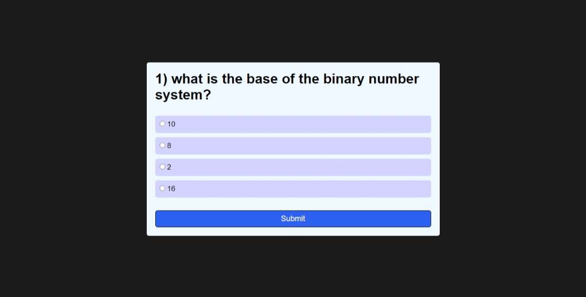
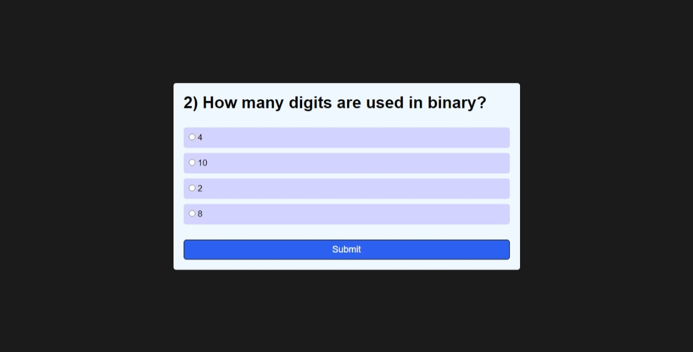
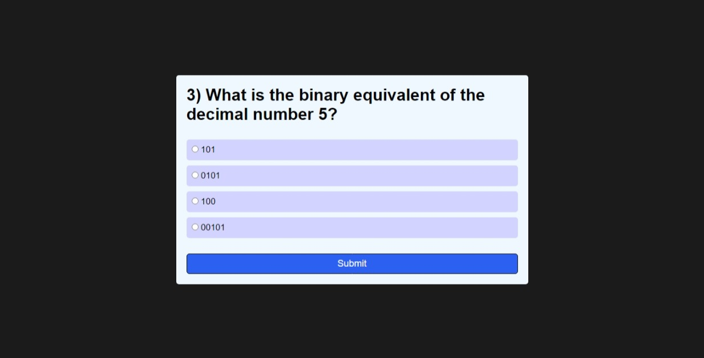

# 💻 Binary Quiz App 💻

This repository contains the code for a simple yet engaging binary quiz app. Test your knowledge of this fundamental computer science concept with this interactive quiz.

## 🧠 What is it?

This app presents a series of multiple-choice questions related to the binary number system. The questions cover topics such as:

* The base of the binary system
* The number of digits used in binary
* Converting between decimal and binary numbers
* The meaning of 0 and 1 in binary
* The importance of binary in computer science

## 🚀 Features

* **Interactive Quiz:**  Engage with a series of multiple-choice questions.
* **Instant Feedback:**  Get immediate feedback on your answers.
* **Track Progress:**  See how many questions you answered correctly.
* **Clear and Concise:**  The questions are written in a way that is easy to understand.
* **Fun and Educational:**  Learn about binary while having a good time!

## 💡 How to Use

1. **Clone the repository:**
   ```bash
   git clone https://github.com/Gupta-Ravi/JsQuizApp.git
   ```

2. Open the **index.html** file in your web browser.

## 🎥 Demo

[Tutorial video Link](https://youtu.be/u9NFuoITzrs?si=4rp0KrVOJU9VLxL7) 

## 🌐 Live Demo

[Demo Link](https://gupta-ravi.github.io/JsQuizApp/)

* **Note:**  Replace `your-username` with your actual GitHub username.

## ✨ Screenshots







## 🤝 Contributing

Contributions are always welcome! If you find a bug or have a feature request, please feel free to open an issue or submit a pull request.

## 📝 License

This project is licensed under the MIT License.

## 🎉  Enjoy Learning!

Have fun learning about binary with this interactive quiz! 